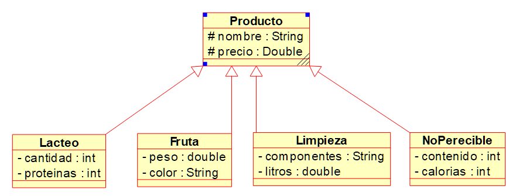

Para la tarea se pide desarrollar un diseño orientado a objetos 
para un almacén y verdulería, como requerimiento vamos a tener 4
clases de productos Fruta, Limpieza, Lacteo y NoPerecible, todas 
tiene en común dos atributos el nombre (string) y precio (double) 
que deben heredar de la clase padre Producto, pero además cada una 
van a tener dos atributos propios adicionales, sus métodos getter 
y constructor para inicializar los 4 atributos (los 2 del padre y 
los 2 propios). Los atributos adicionales de cada clase se detalla 
en el siguiente diagrama de clase:

Para el ejemplo de la clase main se pide crear dos objetos por cada 
tipo de producto que deben ser almacenados en un arreglo del tipo 
Producto, se debe mostrar iterando el arreglo, por cada uno el 
detalle completo, el precio, nombre y los atributos adicionales.